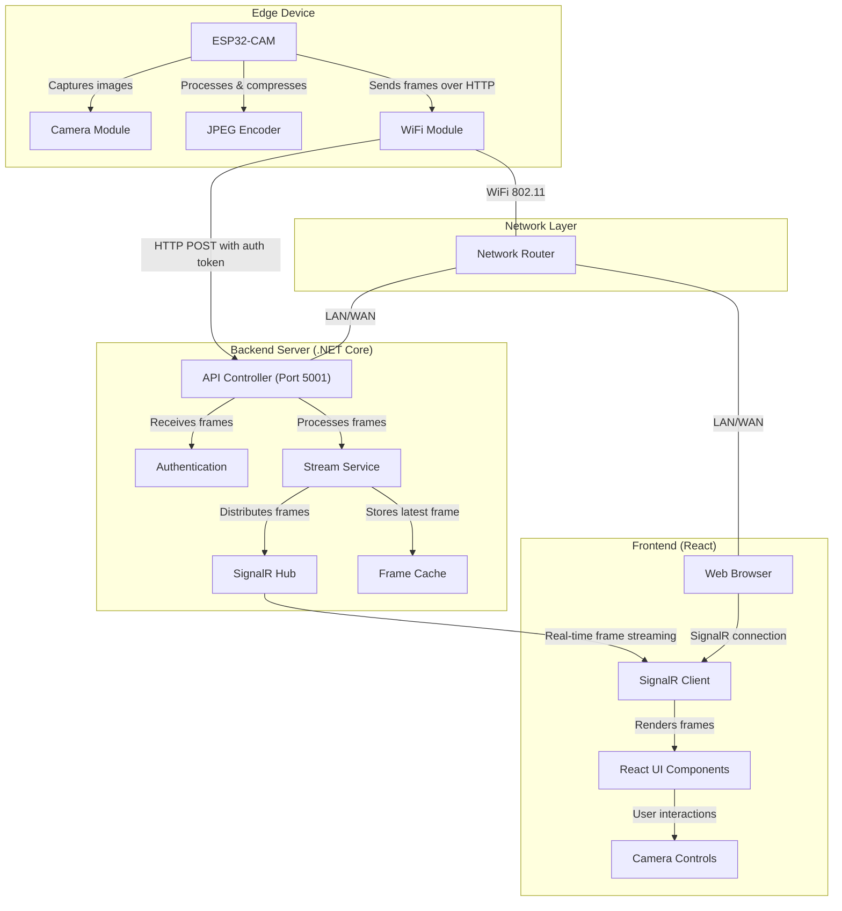
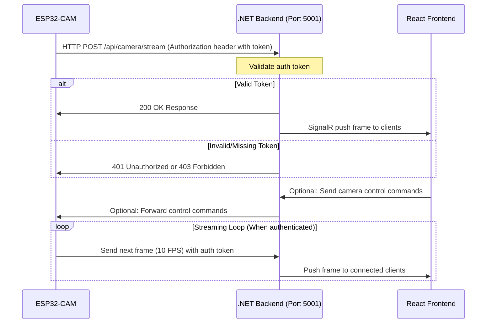
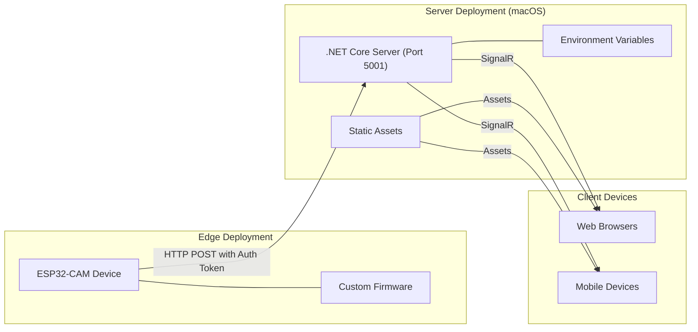
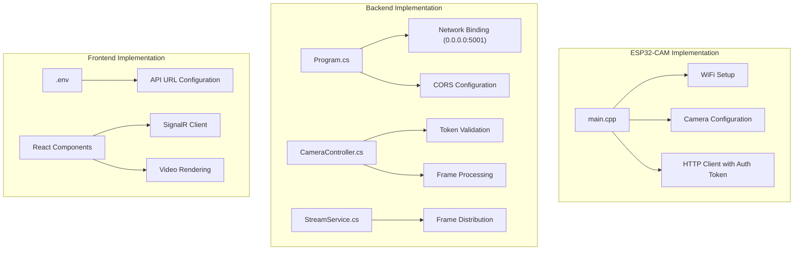
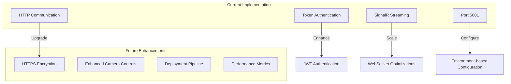

# ArchI Camera Streaming System Architecture

## System Overview

## Component Details

### Edge Device (ESP32-CAM)
- **Camera Module**: OV2640 sensor capturing raw image data
- **ESP32 Processor**: Dual-core microcontroller handling image processing and network communication
- **JPEG Encoder**: Hardware-accelerated compression for efficient transmission
- **WiFi Module**: Establishes secure connection to backend server
- **Authentication**: Uses token-based authentication for secure API access (via HTTP headers)

### Backend Server (.NET Core)
- **API Controller**: RESTful endpoints for receiving camera frames and status information (on port 5001)
- **Authentication Service**: Validates incoming requests using token authentication (matches "test_token" or env variable)
- **Stream Service**: Processes and optimizes incoming video frames
- **Frame Cache**: Maintains the most recent frame for late-joining clients
- **SignalR Hub**: Real-time communication channel to connected clients
- **Network Binding**: Configured to listen on all network interfaces (0.0.0.0)
- **Logging**: Comprehensive logging with Serilog (console and rotating files)

### Frontend (React)
- **SignalR Client**: Establishes real-time connection to backend hub
- **React Components**: Renders video stream and UI elements
- **Camera Controls**: Optional interface for camera adjustments
- **Responsive UI**: Adapts to different device screen sizes

## Data Flow

1. ESP32-CAM captures images from the camera module
2. Images are compressed to JPEG format
3. ESP32-CAM establishes HTTP connection with backend server (port 5001)
4. Authentication token is included in HTTP Authorization header
5. Backend validates the token and processes the incoming frame
6. SignalR hub broadcasts the frame to all connected clients
7. Frontend receives frames in real-time and renders them in the UI
8. User interactions from the frontend can send control commands back to the camera

## Network Architecture

## Security Considerations

- Authentication token required for all camera-to-server communication via HTTP Authorization header
- Token validation performed on every frame submission to prevent unauthorized access
- Network traffic can be encrypted with HTTPS for production deployment (future enhancement)
- Backend validates frame size and rate to prevent DoS attacks
- Backend server bound to all interfaces (0.0.0.0) but protected by authentication
- Frontend connects only to authorized backend servers
- Environment variables used for sensitive configuration values in production

## Deployment Architecture

## Implementation Details

## System Evolution & Future Enhancements

### Recommended Future Enhancements

1. **Security Improvements**
   - Implement HTTPS for encrypted communication
   - Replace simple token with JWT authentication
   - Add rate limiting for API endpoints

2. **Feature Enhancements**
   - Add camera controls (resolution, FPS, exposure)
   - Implement multi-camera support
   - Add video recording capabilities

3. **DevOps Improvements**
   - Create Docker containers for easy deployment
   - Set up CI/CD pipeline for automated testing and deployment
   - Add monitoring and alerting for system health

4. **Performance Optimizations**
   - Optimize frame compression and transmission
   - Implement adaptive streaming based on network conditions
   - Add caching mechanisms for improved performance

## Conclusion

The ArchI Camera Streaming System provides a robust architecture for real-time video streaming from an ESP32-CAM to web browsers through a .NET Core backend. The system uses token-based authentication for security, SignalR for real-time communication, and a React frontend for displaying the video stream.

With the recent fixes to address the 403 Forbidden error, the system now properly authenticates the ESP32-CAM requests and allows for cross-device communication by binding the server to all network interfaces on port 5001, avoiding conflicts with macOS AirPlay services.

## 403 Forbidden Error Resolution

The system previously experienced 403 Forbidden errors due to multiple issues that were resolved with the following changes:

1. **Authentication Implementation**:
   - Added an authentication token in the ESP32-CAM firmware (`const char *authToken = "test_token"`)
   - Configured the ESP32-CAM to send this token in the HTTP Authorization header
   - Updated the backend CameraController to validate incoming requests against this token

2. **Network Configuration**:
   - Changed the backend server to listen on all network interfaces (`0.0.0.0`) instead of just localhost
   - Updated the server port from 5000 to 5001 to avoid conflicts with macOS AirPlay services
   - Updated the frontend environment variables to use the new port

These changes ensured that:
- The ESP32-CAM could properly authenticate with the server
- The server was accessible from devices on the local network
- No port conflicts occurred with system services
