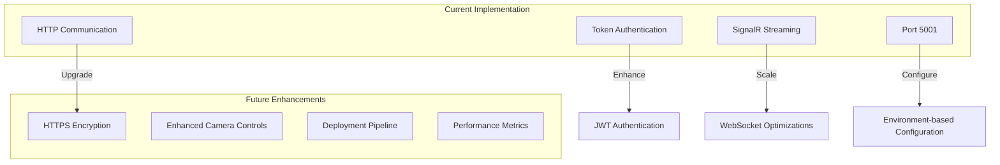

## System Evolution & Future Enhancements

### Recommended Future Enhancements

1. **Security Improvements**
   - Implement HTTPS for encrypted communication
   - Replace simple token with JWT authentication
   - Add rate limiting for API endpoints

2. **Feature Enhancements**
   - Add camera controls (resolution, FPS, exposure)
   - Implement multi-camera support
   - Add video recording capabilities

3. **DevOps Improvements**
   - Create Docker containers for easy deployment
   - Set up CI/CD pipeline for automated testing and deployment
   - Add monitoring and alerting for system health

4. **Performance Optimizations**
   - Optimize frame compression and transmission
   - Implement adaptive streaming based on network conditions
   - Add caching mechanisms for improved performance

## Conclusion

The ArchI Camera Streaming System provides a robust architecture for real-time video streaming from an ESP32-CAM to web browsers through a .NET Core backend. The system uses token-based authentication for security, SignalR for real-time communication, and a React frontend for displaying the video stream.

With the recent fixes to address the 403 Forbidden error, the system now properly authenticates the ESP32-CAM requests and allows for cross-device communication by binding the server to all network interfaces on port 5001, avoiding conflicts with macOS AirPlay services.
